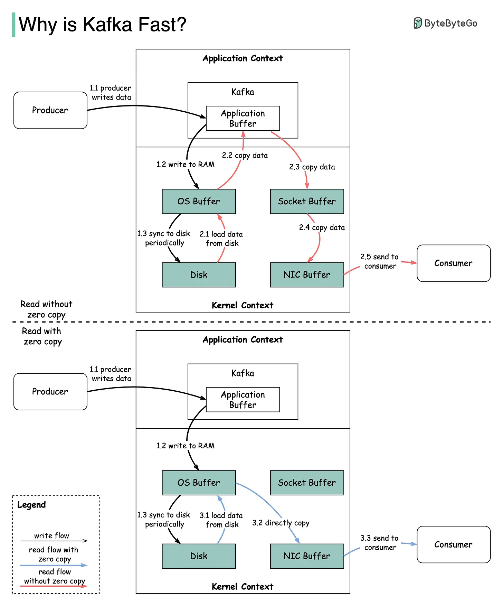

# Micro-services Architecture

## Introduction

Micro-services architecture is a sytle of architecture in which in single application is developed as a suite of services.

## Features

* Small, loosely coupled services which can be handled by a small team.
* Seperate codebase for different services
* Deployed independently
* Storing their own data
* Technology agnostic
* Services communicate via well defined APIs
* Different programming languages can be used.
* Services can be scaled independently
* Easier to implement features and bug fixes
* Fault isolation is easy
* Uses Database per Service Design Pattern

## Characteristics

* Componentization via service
* Products not Projects
* Decentralized Goverance - Netflix follows this characteristic where libraries are made open source.
* Infrastructure Automation
* Design for Failure.

## Challenges

* Complexity - Simple services but entire system is complex
* Network problems and latency
* Development and testing e2e when compared monolithic.
* Data Integrity - We should aim for eventual consistency and transaction are hard to implement

## Decomposition of micro-services

**Steps:**

* Domain Analysis
* Bounded Contexts
* Decompose Strategies 
* Identify Micro-service Boundaries

### Decomposition by Buisness Capablilities:

**Characteristics of m8s :**

* must be cohesive
* must be loosely coupled
* according to buisness capabilities

## Communication

* Sync or Async communication ?  
* Uses http (client - m8s) or gRPC (inter -m8s) or message brokers.

|Rest API | gRPC|
|:-------:|:----|
|Slower | Faster|
|uses Json|uses protobuf|
|payloads are human readable | payloads are not human readable|

### Synchronous communication

#### REST

REST (Representational Stateless Transfer)

Features

* Stateless
* Cacheable
* Code on Demand
* Uniform Interface
* Layered System

Richardson Maturity Model

* Level 0 : One URI
* Level 1 : Create seperate URIs
* Level 2 : Use HTTP methods
* Level 3 : Use hypermedia

#### API Versioning

use v1,v2,v3 etc for REST URI so that in future when API gets changed 

* It doesnt break some communication
* backward compatible and it will not break any communication
* Best Pratice. 

#### gRPC (gRPC Remote Procedure Call)

* Uses HTTP/2 protocol
* Open source
* Binary serialization

### API Handler

#### Drawbacks of direct client to m8s communication

* Causes problems as number of m8s increases
* When adding new m8s all the client applications would have to be modified accordingly.
* Increases latency and complexity on the UI side.

#### Feature

* Can Aggregate several m8s in one response
* Handles routing to internal m8s
* Helps in IAM
* Helps in Load Balancing
* Helps in Logging, Tracing

#### Cons

* Singele point of failure

#### Patterns

* Gateway Routing Pattern
* Gateway Aggregation Pattern
* Gateway Offloading Pattern

### BFF ( Backend for Frontends) 

* Seperate API Gateways usually based on clients

### Service Registry Pattern

* Used to know the IPs and ports of internal m8s
* k8s handles this internally.

### Asynchoronous Communication

* Event driven communication
* Helps in reducing coupling

#### Apache Kafka

* Open Source event streaming platforms
* Horizontally scalable , distributed and fault tolerant
* Topics, Partitions , Offsets and Replication Factor

**Use Cases**

* Log Aggregation
* Messaging btwn m8s
* Metrics - Operational data
* Stream Processing  

### Scaling m8s

#### The scale cube

* x axis - horizontal duplication of services and data
* y axis - scaling by functional decomposition
* z axis - scaling by splitting similar things (only data will be different)

## Data Management

* Isolating each services databases
* Avoid single point of failure for databases

### Database Patterns

* Datbase Per Service Pattern
* API Composition Pattern (Aggregator pattern)
* The CQRS Pattern
* The Event Sourcing Pattern
* The Saga Pattern
* The shared database anti pattern

#### Datbase Per Service Pattern

* Scale idenpendantly for each database
* Allows us for use different databases , thus allowing us to chose optimal database  for use-case.
* No impact in case of schema changes

#### The shared database anti pattern

* Shared database for m8s
* Reduces the advantages of m8s such as reducing coupling 

### How to choose database for micro-services

* Consistency level - strict consistency or eventual consistency.for strict consistency choose RDMS.

* Consider CAP theorem

#### Data Partioning

* Horizontal Partitioning (Sharding) : Same schema
* Vertical Partitioning (Row partitioning) : Rows are split
* Functional Partitioning

## Queries Data Management

### Materialized View Pattern

* Stores local copy of Data
* Increases resilency since it wont be impacted by the failure of other m8s
* Increases latency by avoiding synchronous calls to other m8s

#### Drawbacks

* How & when denormalized data will be updated
* Source of data is other m8s

### CQRS Design Pattern

Stands for Command and Query Seggregation. Suitable for applications with complex queries as well as CRUD operations.
Sync database can be handled by eventbus

### Event Sourcing Pattern

In the write database , the data stored is the events . The adavantage is that events can be replayed.

## m8s Transcation Pattern

### Saga Pattern

* Choreograhy Saga Pattern

* Orchestration Sage Pattern - Single Point of failure .

### Outbox Pattern

## Event Driven m8s Architecture

* All m8s  and clients communicate via events, these make the architecture easy to understand.
* Decoupling

### Why is Kafka so fast?

The throughput of Kafka is very high meaning it can handle a large number of files at a time.
The reason for this is due to two major design decisions. 

Kafka uses
* Sequential I/O instead of random access . In modern hardware using sequential over random access provides
a speed of 100MB/s instead of 100KB/s.
* Zero Copy Principle 

## Distributed Caching

* Caching usuallly done at api handler

## References

* <https://blog.bytebytego.com/p/why-is-kafka-fast>